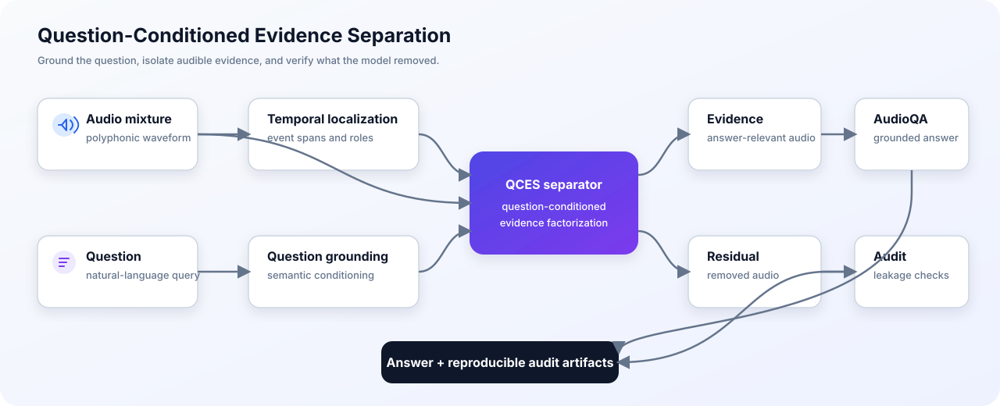

# QCES

QCES (**Question-Conditioned Evidence Separation**) is a research system that
takes a complex audio mixture and a natural-language question, identifies the
relevant time regions, separates useful evidence from residual audio, and
passes grounded evidence to an audio question-answering model.

[Open the live demo](https://mixiunderstanding.solanai.us)

> **Project status:** active research. The repository contains the reusable
> implementation and validation code; datasets, checkpoints, generated audio,
> experiment outputs, and private research notes stay local.

## How it works



The implementation includes temporal grounding, overlap-aware event roles,
evidence/residual factorization, no-evidence handling, benchmark-integrity
checks, data contracts, and evaluation utilities.

## Repository layout

| Path | Purpose |
| --- | --- |
| `code/mixi_understanding/qces/` | Core QCES models, signal processing, metrics, and data logic |
| `code/mixi_understanding/data/` | Versioned schemas and dataset validation |
| `code/mixi_understanding/scripts/` | Python entrypoints for building, training, auditing, and evaluation |
| `code/mixi_understanding/tests/` | Unit and contract tests |
| `live_demo/` | Stable Streamlit entrypoint, runtime dependencies, and deployment metadata |
| `workflows/` | Curated, portable shell workflows supported by this repository |

Large runtime assets are intentionally excluded from Git. See `.gitignore` and
`live_demo/deployment.json` for the boundary between source code and local
deployment state.

## Quick start

Python 3.10 or newer is recommended. A CUDA-capable environment is required for
model training and full inference, but the core contract tests run on CPU.

```bash
git clone --recurse-submodules \
  https://github.com/quocbao2772004/MixiUnderstanding.git
cd MixiUnderstanding

python3 -m venv .venv
source .venv/bin/activate
python -m pip install --upgrade pip
python -m pip install -r code/mixi_understanding/requirements-train.txt

export PYTHONPATH="$PWD/code${PYTHONPATH:+:$PYTHONPATH}"
./workflows/verify-core.sh
```

The dependency sets are separated by use case:

- `requirements-data.txt` — data and signal-processing utilities
- `requirements-train.txt` — core training runtime
- `requirements-phi4mm.txt` — isolated Phi-4 multimodal evaluation runtime
- `requirements-vieneu.txt` — isolated Vietnamese TTS runtime
- `live_demo/requirements.txt` — lightweight Streamlit host process

## Live demo

Install the host dependencies and start Streamlit:

```bash
python -m pip install -r live_demo/requirements.txt
./workflows/live-demo.sh
```

The launcher accepts standard environment overrides:

```bash
PYTHON_BIN=/path/to/python PORT=8515 ADDRESS=127.0.0.1 \
  ./workflows/live-demo.sh
```

The web process is intentionally lightweight. QCES and Audio Flamingo 3 run in
isolated subprocess environments, so a deployment must provide the local model
assets listed in `live_demo/deployment.json`.

### Audio test samples

The repository includes a small, curated set of mono 16 kHz FLAC fixtures for
checking vehicle audio, speech questions, and overlapping-speaker separation:
`[demo_samples/](demo_samples/)`. Start with the [sample guide](demo_samples/README.md),
then upload a file to the live demo and try questions such as “Có những âm thanh
gì?” or “Người thứ hai nói gì?”.

## Reproducible workflows

Only portable, reusable shell entrypoints are versioned. Machine-specific
experiment wrappers are ignored and remain local.

| Command | Description |
| --- | --- |
| `./workflows/verify-core.sh` | Compile the package and run dependency-light contract tests |
| `./workflows/live-demo.sh` | Start the Streamlit live demo |
| `./workflows/availability-progress.sh [state.json]` | Summarize AudioSet availability indexing progress |
| `./workflows/full200-primary.sh [train\|eval\|all]` | Materialize and acoustically grade the frozen 200-class contract |
| `./workflows/full200-resume.sh` | Resume the full-200 workflow across transient failures |

The full-200 workflows expect a prepared execution contract under
`outputs/qces_full200_adaptive_v1/`. Paths and executables can be overridden
without editing source files:

```bash
QCES_PROJECT_ROOT="$PWD" \
QCES_PYTHON_BIN="$(command -v python)" \
QCES_FULL200_DIR=/path/to/execution-contract \
QCES_FULL200_SCRATCH_ROOT=/path/to/scratch \
  ./workflows/full200-primary.sh all
```

## Testing

Use the curated CPU-friendly check for a fast repository validation:

```bash
./workflows/verify-core.sh
```

Run the complete suite only in the full training environment because several
tests import PyTorch and model-specific dependencies:

```bash
PYTHONPATH=code python -m unittest discover \
  -s code/mixi_understanding/tests \
  -p 'test_*.py'
```

## Data and artifact policy

Do not commit credentials, raw audio, downloaded datasets, model checkpoints,
generated outputs, logs, or machine-specific launch commands. Keep reproducible
logic in Python modules or `workflows/`, and configure local paths through
environment variables.

## Citation

This repository currently tracks an active research project. A formal citation
will be added when the accompanying paper is released.
